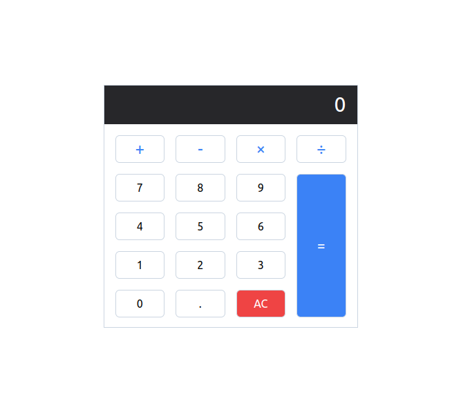

<!-- ABOUT THE PROJECT -->
## About The Project

I created a mini project to test and improve my JavaScript and Tailwind skills.
This is a mini calculator as you see, it's so simple and I tried to 

### Live Site
If you want to see how it works, and active statements please visit this site.

* https://basic-calculator-mini-project.netlify.app/

## Preview

## Built With

### JavaScript
* Fundamental JavaScript
* DOM

### Tailwind
* Flexbox
* Grid